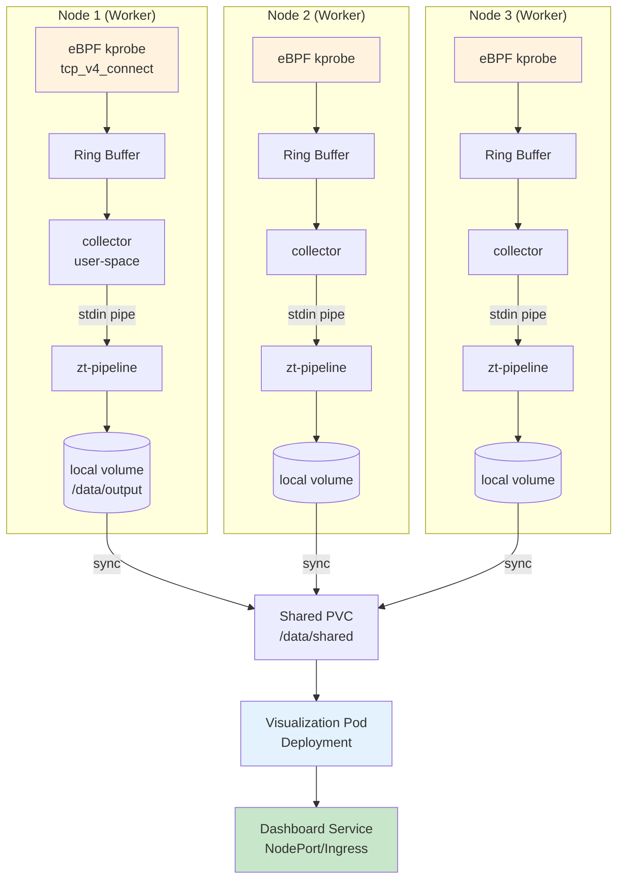
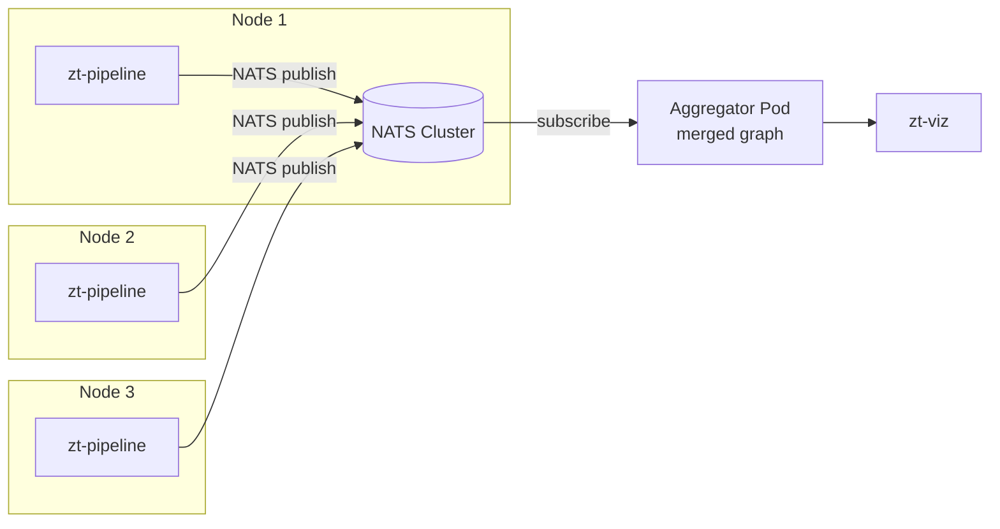

# Hướng dẫn triển khai Zero-Trust Network Mapper lên Kubernetes
# K8s Deployment Guide for Zero-Trust Network Mapper

---

## 1. Tổng quan kiến trúc triển khai (Deployment Architecture)



**Phân lớp:**
1. **DaemonSet layer** — 1 pod giám sát trên mỗi node, chạy eBPF + pipeline engine
2. **Storage layer** — PersistentVolumeClaim tập hợp alerts/graph từ tất cả nodes
3. **Visualization layer** — Deployment chạy Python renderer, expose qua Service

---

## 2. Điều kiện tiên quyết (Prerequisites)

### 2.1. Cluster requirements

| Yêu cầu | Lý do |
|---------|-------|
| Kubernetes ≥ 1.24 | Hỗ trợ `seccompProfile: RuntimeDefault`, PSA |
| Kernel ≥ 5.8 trên mọi node | `BPF_MAP_TYPE_RINGBUF` yêu cầu kernel 5.8+ |
| CONFIG_BPF=y, CONFIG_BPF_SYSCALL=y | eBPF kernel support |
| CONFIG_DEBUG_INFO_BTF=y | CO-RE (Compile Once, Run Everywhere) |
| Container runtime có `/sys/kernel/debug` accessible | BPF program attach |
| Privileged pods được phép trong namespace `monitoring` | eBPF cần `CAP_BPF`, `CAP_PERFMON` |

### 2.2. Kiểm tra cluster

```bash
# Check kernel version trên mọi node
kubectl get nodes -o jsonpath='{range .items[*]}{.metadata.name}{"\t"}{.status.nodeInfo.kernelVersion}{"\n"}{end}'

# Check BTF support (cần trên mọi node)
for node in $(kubectl get nodes -o name); do
  kubectl debug $node -it --image=busybox -- ls /sys/kernel/btf/vmlinux
done

# Check Pod Security Admission policy
kubectl get ns monitoring -o jsonpath='{.metadata.labels}'
```

Nếu PSA level là `restricted`, cần đổi sang `privileged` cho namespace `monitoring`:

```bash
kubectl label ns monitoring \
  pod-security.kubernetes.io/enforce=privileged \
  pod-security.kubernetes.io/warn=privileged \
  --overwrite
```

---

## 3. Build container image (Container Image Build)

### 3.1. Dockerfile — Multi-stage build

```dockerfile
# Dockerfile.zt-mapper

# ─── Stage 1: Build eBPF object + pipeline ─────────────────────────────────
FROM ubuntu:24.04 AS builder

RUN apt-get update && apt-get install -y --no-install-recommends \
        clang llvm \
        libbpf-dev libelf-dev zlib1g-dev \
        cmake build-essential \
        bpftool linux-headers-generic \
        ca-certificates \
    && rm -rf /var/lib/apt/lists/*

WORKDIR /src
COPY . /src

# Generate vmlinux.h from host BTF (at build time — must match runtime kernel's BTF layout)
# Better: use pre-generated vmlinux.h checked into repo
RUN if [ ! -f ebpf-collector/src/kern/vmlinux.h ]; then \
        bpftool btf dump file /sys/kernel/btf/vmlinux format c \
            > ebpf-collector/src/kern/vmlinux.h || \
        echo "Warning: vmlinux.h not generated — runtime must supply it"; \
    fi

# Compile eBPF object
RUN clang -O2 -g -Wall -target bpf \
        -D__TARGET_ARCH_x86 \
        -I ebpf-collector/src/kern \
        -c ebpf-collector/src/kern/tcp_connect.bpf.c \
        -o /tmp/tcp_connect.bpf.o

# Compile user-space binaries
RUN cmake -B build -DBUILD_EBPF=ON -DBUILD_PIPELINE=ON \
                   -DBUILD_TESTS=OFF -DBUILD_BENCHMARKS=OFF \
    && cmake --build build -j$(nproc)

# ─── Stage 2: Runtime image ────────────────────────────────────────────────
FROM ubuntu:24.04

RUN apt-get update && apt-get install -y --no-install-recommends \
        libbpf1 libelf1 zlib1g \
        ca-certificates \
    && rm -rf /var/lib/apt/lists/*

# Copy binaries
COPY --from=builder /src/build/ebpf-collector/collector /usr/local/bin/zt-collector
COPY --from=builder /src/build/pipeline/zt-pipeline     /usr/local/bin/zt-pipeline
COPY --from=builder /tmp/tcp_connect.bpf.o              /etc/zt-mapper/
COPY config/pipeline.yaml                                /etc/zt-mapper/

# Create output directory
RUN mkdir -p /data/output

WORKDIR /etc/zt-mapper

# Entrypoint: pipe collector → pipeline (reads from stdin when type=ebpf)
ENTRYPOINT ["/bin/sh", "-c", \
    "zt-collector | zt-pipeline --config /etc/zt-mapper/pipeline.yaml"]
```

### 3.2. Visualization Dockerfile

```dockerfile
# Dockerfile.zt-viz
FROM python:3.12-slim

RUN pip install --no-cache-dir networkx matplotlib

COPY visualization/viz/graph_renderer.py /app/renderer.py
WORKDIR /app

# Re-render every 30 seconds
ENTRYPOINT ["/bin/sh", "-c", \
    "while true; do \
         python /app/renderer.py \
             --graph /data/output/graph.json \
             --alerts /data/output/alerts.json \
             --stats /data/output/stats.json \
             --output /data/output/dashboard.png; \
         sleep 30; \
     done"]
```

### 3.3. Build & push

```bash
# Thay YOUR_REGISTRY bằng registry thực (Docker Hub, Harbor, ECR, v.v.)
REGISTRY=your-registry.example.com
VERSION=v1.0.0

docker build -f Dockerfile.zt-mapper -t ${REGISTRY}/zt-mapper:${VERSION} .
docker build -f Dockerfile.zt-viz    -t ${REGISTRY}/zt-viz:${VERSION} .

docker push ${REGISTRY}/zt-mapper:${VERSION}
docker push ${REGISTRY}/zt-viz:${VERSION}
```

**Lưu ý về vmlinux.h:**
- Nếu build image trên máy khác với worker nodes, BTF layout có thể khác → compile BPF lỗi
- **Giải pháp tốt nhất:** commit file `vmlinux.h` đã generate vào repo, hoặc dùng BTFHub (https://github.com/aquasecurity/btfhub) để lấy BTF cho từng kernel version

---

## 4. Kubernetes Manifests

### 4.1. Namespace

**`deploy/00-namespace.yaml`**

```yaml
apiVersion: v1
kind: Namespace
metadata:
  name: monitoring
  labels:
    pod-security.kubernetes.io/enforce: privileged
    pod-security.kubernetes.io/warn: privileged
    pod-security.kubernetes.io/audit: privileged
    app.kubernetes.io/name: zt-mapper
```

### 4.2. RBAC

**`deploy/01-rbac.yaml`**

```yaml
# ServiceAccount cho DaemonSet
apiVersion: v1
kind: ServiceAccount
metadata:
  name: zt-mapper
  namespace: monitoring
---
# ClusterRole: chỉ cần đọc node info (tùy chọn — enrichment trong alerts)
apiVersion: rbac.authorization.k8s.io/v1
kind: ClusterRole
metadata:
  name: zt-mapper-reader
rules:
  - apiGroups: [""]
    resources: ["nodes", "pods", "namespaces"]
    verbs: ["get", "list", "watch"]
---
apiVersion: rbac.authorization.k8s.io/v1
kind: ClusterRoleBinding
metadata:
  name: zt-mapper-reader
roleRef:
  apiGroup: rbac.authorization.k8s.io
  kind: ClusterRole
  name: zt-mapper-reader
subjects:
  - kind: ServiceAccount
    name: zt-mapper
    namespace: monitoring
```

### 4.3. ConfigMap — Pipeline Configuration

**`deploy/02-configmap.yaml`**

```yaml
apiVersion: v1
kind: ConfigMap
metadata:
  name: zt-mapper-config
  namespace: monitoring
data:
  pipeline.yaml: |
    algorithms:
      frequency_estimator:
        name: "count_min_sketch"
        params:
          width: 2048
          depth: 5
          threshold: 100

      scc_detector:
        name: "tarjan"

      reachability:
        name: "bfs"
        params:
          max_hops: 3

      ip_classifier:
        name: "lpm_trie"

    networks:
      - cidr: "10.244.0.0/16"
        label: 1
        name: "pod_network"
      - cidr: "10.96.0.0/12"
        label: 2
        name: "service_network"
      - cidr: "192.168.0.0/16"
        label: 3
        name: "node_network"
      - cidr: "172.16.0.0/12"
        label: 4
        name: "private_rfc1918"
      - cidr: "0.0.0.0/0"
        label: 0
        name: "external"

    event_source:
      type: "ebpf"

    analysis:
      window_seconds: 60
      scc_interval_seconds: 10
      snapshot_interval_seconds: 5

    output:
      alerts_file: "/data/output/alerts.json"
      graph_file:  "/data/output/graph.json"
      stats_file:  "/data/output/stats.json"
```

### 4.4. PersistentVolumeClaim — Storage

**`deploy/03-pvc.yaml`**

```yaml
apiVersion: v1
kind: PersistentVolumeClaim
metadata:
  name: zt-mapper-data
  namespace: monitoring
spec:
  accessModes:
    - ReadWriteMany                # Cần RWX để DaemonSet + viz cùng mount
  resources:
    requests:
      storage: 10Gi
  storageClassName: nfs-client     # Thay bằng RWX storage class của cluster
```

**Lưu ý:** Nếu cluster không có RWX storage class (phổ biến với local clusters):
- Dùng `ReadWriteOnce` + 1 PVC mỗi node (node-local)
- Hoặc dùng **NATS/Kafka** để stream events từ DaemonSet → central aggregator
- Hoặc ghi thẳng vào **OpenSearch/Elasticsearch** qua Fluent Bit sidecar

### 4.5. DaemonSet — eBPF Collector + Pipeline

**`deploy/10-daemonset.yaml`**

```yaml
apiVersion: apps/v1
kind: DaemonSet
metadata:
  name: zt-mapper
  namespace: monitoring
  labels:
    app.kubernetes.io/name: zt-mapper
    app.kubernetes.io/component: collector
spec:
  selector:
    matchLabels:
      app: zt-mapper
  updateStrategy:
    type: RollingUpdate
    rollingUpdate:
      maxUnavailable: 1

  template:
    metadata:
      labels:
        app: zt-mapper
    spec:
      serviceAccountName: zt-mapper

      # Chạy trên host network để có IP thực của node (không bị NAT qua Pod CIDR)
      hostNetwork: true
      hostPID: true
      dnsPolicy: ClusterFirstWithHostNet

      # Bắt buộc tolerate để chạy cả trên control-plane (nếu cần giám sát)
      tolerations:
        - operator: Exists

      # Bắt buộc priority class để không bị evict khi node pressure
      priorityClassName: system-node-critical

      containers:
        - name: collector
          image: your-registry.example.com/zt-mapper:v1.0.0
          imagePullPolicy: IfNotPresent

          securityContext:
            privileged: true                # Cần cho eBPF kprobe attach
            capabilities:
              add:
                - SYS_ADMIN                 # Tối thiểu cho BPF_PROG_LOAD
                - BPF                        # Linux ≥ 5.8: chỉ cần CAP_BPF
                - PERFMON                    # Kprobe perf events
            runAsUser: 0                    # eBPF cần root

          resources:
            requests:
              cpu: 100m
              memory: 128Mi
            limits:
              cpu: 500m
              memory: 512Mi

          env:
            - name: NODE_NAME
              valueFrom:
                fieldRef:
                  fieldPath: spec.nodeName
            - name: POD_NAMESPACE
              valueFrom:
                fieldRef:
                  fieldPath: metadata.namespace

          volumeMounts:
            # Kernel debug filesystem — eBPF attach point
            - name: sys-kernel-debug
              mountPath: /sys/kernel/debug

            # Kernel modules — CO-RE relocation
            - name: lib-modules
              mountPath: /lib/modules
              readOnly: true

            # BTF (Kernel type info)
            - name: sys-kernel-btf
              mountPath: /sys/kernel/btf
              readOnly: true

            # Pipeline config
            - name: config
              mountPath: /etc/zt-mapper/pipeline.yaml
              subPath: pipeline.yaml

            # Output directory (shared hoặc local)
            - name: output
              mountPath: /data/output

          # Liveness: check zt-pipeline is writing stats.json
          livenessProbe:
            exec:
              command:
                - /bin/sh
                - -c
                - "test -f /data/output/stats.json && find /data/output/stats.json -mmin -2"
            initialDelaySeconds: 60
            periodSeconds: 60
            timeoutSeconds: 10

      volumes:
        - name: sys-kernel-debug
          hostPath:
            path: /sys/kernel/debug
        - name: lib-modules
          hostPath:
            path: /lib/modules
        - name: sys-kernel-btf
          hostPath:
            path: /sys/kernel/btf
        - name: config
          configMap:
            name: zt-mapper-config
        - name: output
          persistentVolumeClaim:
            claimName: zt-mapper-data
```

### 4.6. Visualization Deployment

**`deploy/20-viz-deployment.yaml`**

```yaml
apiVersion: apps/v1
kind: Deployment
metadata:
  name: zt-viz
  namespace: monitoring
  labels:
    app: zt-viz
spec:
  replicas: 1
  selector:
    matchLabels:
      app: zt-viz
  template:
    metadata:
      labels:
        app: zt-viz
    spec:
      containers:
        - name: viz
          image: your-registry.example.com/zt-viz:v1.0.0
          imagePullPolicy: IfNotPresent

          resources:
            requests:
              cpu: 50m
              memory: 128Mi
            limits:
              cpu: 200m
              memory: 256Mi

          volumeMounts:
            - name: output
              mountPath: /data/output

      volumes:
        - name: output
          persistentVolumeClaim:
            claimName: zt-mapper-data
```

### 4.7. Service (optional — expose dashboard)

**`deploy/30-service.yaml`**

```yaml
# Simple HTTP server serving the PNG + JSON files
apiVersion: v1
kind: Service
metadata:
  name: zt-dashboard
  namespace: monitoring
spec:
  type: NodePort
  selector:
    app: zt-viz
  ports:
    - name: http
      port: 80
      targetPort: 8080
      nodePort: 30080
```

Muốn xem dashboard trong browser, thêm một sidecar container `nginx` hoặc `python -m http.server`:

```yaml
# Trong Deployment spec.template.spec.containers, thêm:
- name: http
  image: python:3.12-slim
  command: ["python", "-m", "http.server", "8080", "--directory", "/data/output"]
  ports:
    - containerPort: 8080
  volumeMounts:
    - name: output
      mountPath: /data/output
```

Truy cập: `http://<any-node-ip>:30080/dashboard.png`

---

## 5. Triển khai (Deploy)

### 5.1. Apply tất cả manifests

```bash
# Deploy theo thứ tự — prefix số đảm bảo thứ tự đúng
kubectl apply -f deploy/00-namespace.yaml
kubectl apply -f deploy/01-rbac.yaml
kubectl apply -f deploy/02-configmap.yaml
kubectl apply -f deploy/03-pvc.yaml
kubectl apply -f deploy/10-daemonset.yaml
kubectl apply -f deploy/20-viz-deployment.yaml
kubectl apply -f deploy/30-service.yaml

# Hoặc apply all trong một lần:
kubectl apply -f deploy/
```

### 5.2. Kiểm tra trạng thái

```bash
# DaemonSet phải có pod chạy trên mọi node
kubectl -n monitoring get ds zt-mapper
# DESIRED   CURRENT   READY   UP-TO-DATE   AVAILABLE   NODE SELECTOR   AGE
# 3         3         3       3            3           <none>          2m

# Pod chi tiết
kubectl -n monitoring get pods -l app=zt-mapper -o wide

# Logs — xác nhận eBPF attached và pipeline running
kubectl -n monitoring logs -l app=zt-mapper --tail=50

# Kỳ vọng output:
# Zero-Trust Mapper: eBPF collector started.
# Capturing TCP connections... (Ctrl+C to stop)
# [pipeline] Loading config: /etc/zt-mapper/pipeline.yaml
# [pipeline] Processing events...
```

### 5.3. Xác minh eBPF hoạt động

```bash
# Check eBPF programs đã load trên host
kubectl debug node/<node-name> -it --image=busybox -- \
    chroot /host bpftool prog list | grep tcp_v4_connect

# Kỳ vọng:
# 123: kprobe  name tcp_v4_connect_entry  ...
# 124: kprobe  name tcp_v4_connect_return ...

# Check maps
kubectl debug node/<node-name> -it --image=busybox -- \
    chroot /host bpftool map list | grep -E "(cidr_map|events)"
```

---

## 6. Test với attack simulation

### 6.1. Tạo test topology

```bash
# Deploy test microservices
kubectl create deployment frontend --image=nginx --replicas=2
kubectl create deployment backend --image=nginx --replicas=2
kubectl create deployment database --image=postgres \
    --env=POSTGRES_PASSWORD=test

# Sinh traffic bình thường
for i in {1..50}; do
    kubectl exec deploy/frontend -- curl -s http://backend > /dev/null
    kubectl exec deploy/backend -- curl -s http://database:5432 || true
done
```

### 6.2. Simulate port scan

```bash
# Deploy attacker pod
kubectl run attacker --image=alpine --restart=Never -- \
    sh -c "apk add nmap && nmap -sT -p 1-1000 10.244.0.0/24"

# Theo dõi alerts
kubectl -n monitoring logs -l app=zt-mapper -f | grep ALERT
```

### 6.3. Check dashboard

```bash
# Port-forward để xem dashboard
kubectl -n monitoring port-forward svc/zt-dashboard 8080:80

# Mở browser: http://localhost:8080/dashboard.png
# Hoặc copy file ra local:
kubectl -n monitoring exec deploy/zt-viz -- cat /data/output/dashboard.png \
    > dashboard.png
```

### 6.4. Kỳ vọng kết quả

- **Alerts**: `10.244.x.x` (attacker IP) xuất hiện trong `alerts.json` với type `port_scan`
- **Blast radius**: BFS phát hiện >50 nodes trong 3 hops từ attacker
- **Graph**: Panel (b) trong dashboard hiện attacker ở center, nhiều target radiating out

---

## 7. Production considerations

### 7.1. Performance tuning

| Metric | Default | Tune khi |
|--------|---------|----------|
| Ring Buffer size | 256KB | Tăng lên 1MB nếu drop events (`ring_buffer__poll` error rate >0) |
| CMS width × depth | 2048 × 5 | Tăng width=4096 khi nhiều unique IPs |
| `window_seconds` | 60 | Giảm xuống 30 cho real-time; tăng 300 cho audit |
| `scc_interval_seconds` | 10 | Tăng khi graph lớn (>10K vertices) |
| DaemonSet CPU limit | 500m | Có thể lên 1 CPU cho high-traffic node |
| DaemonSet memory limit | 512Mi | Tăng 1Gi nếu graph > 50K vertices |

### 7.2. Monitoring the monitor

Cần giám sát chính hệ thống giám sát:

```yaml
# Prometheus ServiceMonitor (nếu dùng Prometheus Operator)
apiVersion: monitoring.coreos.com/v1
kind: ServiceMonitor
metadata:
  name: zt-mapper
  namespace: monitoring
spec:
  selector:
    matchLabels:
      app: zt-mapper
  endpoints:
    - port: metrics
      interval: 30s
```

Metrics gợi ý expose từ pipeline:
- `zt_events_processed_total` (counter)
- `zt_alerts_emitted_total{type="port_scan|scc_anomaly|blast_radius"}`
- `zt_ringbuf_drops_total`
- `zt_graph_vertices`, `zt_graph_edges`
- `zt_cms_memory_bytes`

### 7.3. Multi-node event aggregation

Với 3 nodes, mỗi node có graph cục bộ → không thấy cross-node communications.

**Giải pháp:**



Cần sửa `engine.cpp` để emit events ra NATS thay vì file. Tạm thời dừng tại đây — việc này thuộc phase nâng cao.

### 7.4. Security hardening

```yaml
# Thay vì privileged: true, dùng CAP granular (kernel ≥ 5.8)
securityContext:
  privileged: false
  capabilities:
    drop: ["ALL"]
    add:
      - BPF
      - PERFMON
      - NET_ADMIN         # Chỉ nếu cần attach tc filters
  readOnlyRootFilesystem: true
  runAsNonRoot: false     # eBPF vẫn cần UID 0
  seccompProfile:
    type: RuntimeDefault
```

Network Policy giới hạn egress của zt-viz (chỉ cần đọc PVC):

```yaml
apiVersion: networking.k8s.io/v1
kind: NetworkPolicy
metadata:
  name: zt-viz-egress-deny
  namespace: monitoring
spec:
  podSelector:
    matchLabels:
      app: zt-viz
  policyTypes: [Egress]
  egress: []      # Deny all egress
```

---

## 8. Troubleshooting

| Triệu chứng | Nguyên nhân | Khắc phục |
|-------------|-------------|-----------|
| Pod `CrashLoopBackOff`, log `BTF is required` | Kernel thiếu BTF | Install `linux-headers` trên node; hoặc mount BTFHub snapshot |
| `bpf: Invalid argument` khi load | Verifier reject — có unreachable code | `clang -O2` (bắt buộc); giảm độ phức tạp BPF program |
| `/sys/kernel/debug` không tồn tại | Debugfs không mount | `mount -t debugfs none /sys/kernel/debug` trên host |
| Ring buffer drops cao | Pipeline chậm hơn event rate | Tăng ring size; giảm `analysis` frequencies |
| Pod không chạy trên control-plane | Taint không tolerate | Thêm `tolerations: [{operator: Exists}]` |
| Dashboard PNG cũ không update | `sleep 30` chưa chạy / viz pod die | `kubectl logs deploy/zt-viz` |
| Alerts không xuất hiện | CMS threshold quá cao | Giảm `threshold` trong ConfigMap, rollout restart DaemonSet |
| Cross-node traffic không thấy trong graph | Chưa có aggregator | Xem section 7.3 |

---

## 9. Gỡ bỏ (Cleanup)

```bash
# Gỡ toàn bộ
kubectl delete -f deploy/

# Hoặc gỡ namespace (xóa cả PVC!)
kubectl delete ns monitoring

# eBPF programs tự detach khi container chết. Xác minh:
bpftool prog list | grep tcp_v4_connect    # Trên mỗi node — phải empty
```

---

## 10. Tham khảo (References)

1. **Kubernetes Docs.** "DaemonSet." https://kubernetes.io/docs/concepts/workloads/controllers/daemonset/
2. **Kubernetes Docs.** "Pod Security Admission." https://kubernetes.io/docs/concepts/security/pod-security-admission/
3. **libbpf.** https://github.com/libbpf/libbpf
4. **BTFHub** — pre-built BTF for various kernels. https://github.com/aquasecurity/btfhub
5. **bpftool.** https://github.com/libbpf/bpftool
6. **Cilium.** "eBPF on Kubernetes — production guide." https://docs.cilium.io
7. **Falco.** "Security Monitoring with eBPF." https://falco.org/docs/
